```mermaid
graph TB
    subgraph Host["YOUR COMPUTER (Host)"]
        SourceCode["📁 Source Code<br/>(apps/web, packages/*)<br/><i>You edit the code here</i>"]

        subgraph Container["🐳 DOCKER CONTAINER (webapp-dev)"]
            SyncedCode["📁 Source Code<br/>(synced from host)"]
            DevServer["⚡ Next.js Dev Server<br/>(yarn dev:web)<br/>• Detects changes (polling)<br/>• Recompiles automatically<br/>• Hot Module Replacement (HMR)"]
            Port["🌐 Port 3030"]
        end
    end

    Browser["🌍 http://localhost:3030"]

    SourceCode -->|"Mounted volume<br/>(synchronization)"| SyncedCode
    SyncedCode --> DevServer
    DevServer --> Port
    Port --> Browser

    style Host fill:#e3f2fd,stroke:#1976d2,stroke-width:2px
    style Container fill:#fff3e0,stroke:#f57c00,stroke-width:2px
    style SourceCode fill:#c8e6c9,stroke:#388e3c,stroke-width:2px
    style SyncedCode fill:#c8e6c9,stroke:#388e3c,stroke-width:2px
    style DevServer fill:#ffccbc,stroke:#d84315,stroke-width:2px
    style Port fill:#b3e5fc,stroke:#0277bd,stroke-width:2px
    style Browser fill:#f3e5f5,stroke:#7b1fa2,stroke-width:2px
```

```mermaid
graph TB
    subgraph Host["YOUR COMPUTER (Host)"]
        SourceCodeProd["📁 Source Code<br/>(apps/web, packages/*)"]

        subgraph ContainerProd["🐳 DOCKER CONTAINER (webapp)"]
            CompiledCode["📦 Compiled Code (standalone)<br/>• .next/standalone files<br/>• Optimized static files<br/>• No source code"]
            ProdServer["🚀 Next.js Production Server<br/>(node server.js)<br/>• Optimized for performance<br/>• No hot reload<br/>• Cache enabled"]
            PortProd["🌐 Port 3030"]
        end
    end

    BrowserProd["🌍 http://localhost:3030"]

    SourceCodeProd -->|"Copied into image<br/>during build"| CompiledCode
    CompiledCode --> ProdServer
    ProdServer --> PortProd
    PortProd --> BrowserProd

    style Host fill:#e3f2fd,stroke:#1976d2,stroke-width:2px
    style ContainerProd fill:#fff3e0,stroke:#f57c00,stroke-width:2px
    style SourceCodeProd fill:#c8e6c9,stroke:#388e3c,stroke-width:2px
    style CompiledCode fill:#ffe0b2,stroke:#e65100,stroke-width:2px
    style ProdServer fill:#ffccbc,stroke:#d84315,stroke-width:2px
    style PortProd fill:#b3e5fc,stroke:#0277bd,stroke-width:2px
    style BrowserProd fill:#f3e5f5,stroke:#7b1fa2,stroke-width:2px
```

# Docker: Development Mode vs Production Mode

## Visual Overview

```mermaid
graph LR
    subgraph DevMode["🔧 DEVELOPMENT MODE"]
        DevFeatures["✅ Hot Reload<br/>✅ Fast Feedback<br/>✅ No Rebuild<br/>⚠️ ~1GB Image"]
    end

    subgraph ProdMode["📦 PRODUCTION MODE"]
        ProdFeatures["✅ Optimized (~200MB)<br/>✅ Max Performance<br/>✅ Production Ready<br/>❌ No Hot Reload"]
    end

    Developer["👨‍💻 Developer<br/>(Coding & Testing)"]
    Deployment["🚀 Deployment<br/>(Production)"]

    Developer -->|"Use for daily work"| DevMode
    DevMode -->|"Test before deploy"| ProdMode
    ProdMode --> Deployment

    style DevMode fill:#c8e6c9,stroke:#388e3c,stroke-width:3px
    style ProdMode fill:#ffccbc,stroke:#d84315,stroke-width:3px
    style Developer fill:#e1f5fe,stroke:#01579b,stroke-width:2px
    style Deployment fill:#f3e5f5,stroke:#4a148c,stroke-width:2px
    style DevFeatures fill:#a5d6a7,stroke:#2e7d32
    style ProdFeatures fill:#ffab91,stroke:#bf360c
```



## Comparison Table

| Feature | Development Mode | Production Mode |
|---------|-----------------|-----------------|
| **Docker File** | `Dockerfile.dev` | `Dockerfile` |
| **Docker Compose** | `docker-compose.dev.yml` | `docker-compose.build.yml` |
| **Environment Variables** | `.env.dev.docker` | `.env.docker` |
| **Container Name** | `webapp-dev` | `webapp` |
| **Image Name** | `ever-teams-webapp:dev` | `ever-teams-webapp:latest` |
| **Hot Reload** | ✅ Yes | ❌ No |
| **Image Size** | ~1 GB | ~200 MB |
| **Next.js Build** | ❌ No (dev server) | ✅ Yes (optimized) |
| **Mounted Volumes** | ✅ Yes (source code) | ❌ No |
| **DevDependencies** | ✅ Installed | ❌ Removed |
| **Multi-stage Build** | ❌ No (1 stage) | ✅ Yes (2 stages) |
| **Start Command** | `yarn dev:web` | `node server.js` |
| **Port** | 3030 | 3030 |
| **Rebuild Required** | ❌ No | ✅ Yes (on each change) |
| **Usage** | Local Development | Deployment / Production |

---

## Development Mode - How It Works

### Architecture



### Workflow

1. **You edit a file** in `apps/web/src/components/MyComponent.tsx`
2. **Docker volume syncs** the change to the container
3. **Next.js detects** the change (thanks to `CHOKIDAR_USEPOLLING=true`)
4. **Next.js recompiles** only the modified module
5. **Browser refreshes** automatically (Hot Module Replacement)
6. **You see the result** in a few seconds!

### Advantages

- **No rebuild**: No need to rebuild the Docker image
- **Fast feedback**: See changes in seconds
- **Isolated environment**: Same environment as production
- **No pollution**: No need to install Node.js on your computer

### Disadvantages

- ⚠️ **Larger image**: ~1 GB (contains all dev tools)
- ⚠️ **Performance**: Slightly slower than native dev server
- ⚠️ **Polling**: Uses more CPU to detect changes

---

## Production Mode - How It Works

### Architecture



### Workflow

1. **Build the image**: `docker-compose build`
   - Copy source code
   - Install dependencies
   - Compile application (`yarn build:web`)
   - Remove devDependencies
   - Create optimized image

2. **Start the container**: `docker-compose up`
   - Start Next.js server in production mode
   - Serve compiled files

3. **Code modification**:
   - ❌ No hot reload
   - ✅ Rebuild required: `docker-compose build`
   - ✅ Restart required: `docker-compose up`

### Advantages

- **Lightweight image**: ~200 MB (only compiled code)
- **Maximum performance**: Optimized and minified code
- **Security**: No source code in the image
- **Production ready**: Identical to deployment

### Disadvantages

- ⚠️ **No hot reload**: Rebuild required on each change
- ⚠️ **Slow build**: 5-10 minutes for each rebuild
- ⚠️ **Slow feedback**: Not suitable for development

---

## When to Use Which Mode?

### Use Development Mode if

- You are **coding** and **testing** features
- You want to see **changes in real-time**
- You want **fast feedback**
- You are developing **React components**, **pages**, **styles**
- You are debugging an issue

### Use Production Mode if

- You want to **test the final version** before deployment
- You want to check the application **performance**
- You want to test the **optimized build**
- You want to simulate the **production environment**
- You want to create an **image for deployment**

---

## Recommended Workflow

```mermaid
graph TD
    Start([👨‍💻 Start Development]) --> BuildDev[🔨 Build Dev Image<br/>./docker-run.sh dev:build]
    BuildDev --> StartDev[▶️ Start Dev Mode<br/>./docker-run.sh dev]
    StartDev --> Code[💻 Code & Test<br/>Changes reload automatically]
    Code --> Decision{More changes?}
    Decision -->|Yes| Code
    Decision -->|No| StopDev[⏹️ Stop Dev<br/>./docker-run.sh stop]

    StopDev --> BuildProd[🔨 Build Production<br/>./docker-run.sh build]
    BuildProd --> StartProd[▶️ Start Production<br/>./docker-run.sh start]
    StartProd --> Test[🧪 Test Production Build<br/>http://localhost:3030]
    Test --> TestOK{Tests OK?}
    TestOK -->|No| StopProd1[⏹️ Stop<br/>./docker-run.sh stop]
    StopProd1 --> StartDev
    TestOK -->|Yes| StopProd2[⏹️ Stop<br/>./docker-run.sh stop]
    StopProd2 --> Commit[📝 Commit & Push<br/>git commit && git push]
    Commit --> End([✅ Done])

    style Start fill:#e1f5fe,stroke:#01579b,stroke-width:2px
    style BuildDev fill:#c8e6c9,stroke:#388e3c,stroke-width:2px
    style StartDev fill:#c8e6c9,stroke:#388e3c,stroke-width:2px
    style Code fill:#c8e6c9,stroke:#388e3c,stroke-width:2px
    style StopDev fill:#ffecb3,stroke:#f57f17,stroke-width:2px
    style BuildProd fill:#ffccbc,stroke:#d84315,stroke-width:2px
    style StartProd fill:#ffccbc,stroke:#d84315,stroke-width:2px
    style Test fill:#ffccbc,stroke:#d84315,stroke-width:2px
    style StopProd1 fill:#ffecb3,stroke:#f57f17,stroke-width:2px
    style StopProd2 fill:#ffecb3,stroke:#f57f17,stroke-width:2px
    style Commit fill:#b2dfdb,stroke:#00695c,stroke-width:2px
    style End fill:#f3e5f5,stroke:#4a148c,stroke-width:2px
    style Decision fill:#fff9c4,stroke:#f57f17,stroke-width:2px
    style TestOK fill:#fff9c4,stroke:#f57f17,stroke-width:2px
```



### For daily development

```bash
# 1. Build the dev image (once)
./docker-run.sh dev:build

# 2. Start in dev mode
./docker-run.sh dev

# 3. Code, test, iterate...
# Changes reload automatically!

# 4. Stop when done
./docker-run.sh stop
```

### Before commit / push

```bash
# 1. Test in production mode
./docker-run.sh build
./docker-run.sh start

# 2. Verify everything works
# Open http://localhost:3030

# 3. Stop
./docker-run.sh stop

# 4. Commit and push
git add .
git commit -m "feat: new feature"
git push
```

---

## Tips

### Switch from dev mode to prod mode

```bash
# Stop dev
./docker-run.sh stop

# Start prod
./docker-run.sh build
./docker-run.sh start
```

### Switch from prod mode to dev mode

```bash
# Stop prod
./docker-run.sh stop

# Start dev
./docker-run.sh dev
```

### Clean everything

```bash
# Stop all containers
./docker-run.sh stop

# Remove images
./docker-run.sh clean
```

---

## Common Issues

### Hot reload doesn't work

**Solution**: Check that polling variables are enabled in `.env.dev.docker`:

```bash
CHOKIDAR_USEPOLLING=true
WATCHPACK_POLLING=true
```

### Dev image is too large

**This is normal**! The dev image contains all development tools. Use production mode for a lightweight image.

### Production build is too slow

**This is normal**! Next.js compiles and optimizes all the code. That's why we use dev mode for coding.

---

**Happy coding!**
